# Blueprint: Tailored Résumé — Provenance Pipeline (Approach B) — rev 3

Architecture for proposals.md Approach B, as picked 2026-07-13 (per-bullet claim
granularity; judge failure = "unverified" badge, not block; single-column house
template). Rev 2 folded in grill round-1 findings and the human's decisions on
the five HIGHs; rev 3 folds in round-2 residue (orig-claims for original-text
evidence, split staleness hash, judge-error fail-visible rule, log payloads —
see `grill/tailored-resume-blueprint.md`).
Upstream: `tailored-resume-plan.md` (UX flow + DoD), `research.md` (evidence),
`proposals.md` (trade-offs), DECISIONS.md 2026-07-13 entry (the call). Named
`tailored-resume-blueprint.md` because `architecture.md` would collide with
`ARCHITECTURE.md` on the case-insensitive macOS filesystem.

## Components

| # | Unit | Single responsibility | Depends on |
|---|------|----------------------|------------|
| 1 | Schema: `cv.full_text text`, `cv.sections jsonb`, `project_template` table, `tailor_log` table | Hold the canonical résumé transcription, the persisted split (`{full_text_hash, sections: [{name, start, end}]}`), atomic claims (`claims jsonb: [{id, text, skills: [canonical…]}]` — canonical skills stamped at synthesis time, so the client never imports normalization code), and judge/guard outcomes + payloads for calibration. Manual SQL, same as prior migrations | Supabase (manual step) |
| 2 | `api/tailor.js` | The ONLY new serverless function (slot 9 of 12): dispatcher on `action: transcribe \| split \| generate \| revise`. Judge call is internal to generate/revise, not a public action | 3–6, `@supabase/supabase-js`, Anthropic API (see D3 — new integration pattern) |
| 3 | `src/tailor/anchor.js` | Pure, shared-safe: locate LLM-returned verbatim quotes in the canonical text (exact match, fuzzy fallback ≥0.85), compute section offsets, assert join-coverage: concatenated sections equal `full_text` after whitespace normalization — any residual gap → hard error | nothing (unit-testable like `match.js`) |
| 4 | `src/tailor/provenance.js` | Pure, shared-safe: per-bullet guards — (hard) `claim_ids` non-empty ∧ ⊆ evidence set; (soft) digit-diff: any number in output absent from the evidence universe (claims ∪ pill-claims ∪ section original text) → flag | nothing |
| 5 | `api-lib/tailor/prompts.js` | **Server-only** (lives outside both `api/` — no function slot — and `src/` — never reaches the Vite bundle): build the cached prefix (résumé `full_text` + JD skills + FULL claim corpus incl. pill-claims, `cache_control` breakpoint) + per-action suffixes (per-section claim selection, section text, revision note + prior bullets go in the suffix) + the ONE stable output schema | nothing |
| 6 | `api-lib/tailor/judge.js` | **Server-only**: binary entailment judge ("every fact in X entailed by evidence Y?" where Y = selected claims ∪ pill-claims ∪ the section's orig-claim) on `claude-haiku-4-5`, strict schema `{pass: bool, objection: string\|null}`, temperature 0; every verdict appended to `tailor_log` with its payload (bullets + evidence ids) | Anthropic API, Supabase |
| 7 | `src/tailor/docx.js` | Client-side .docx assembly from approved/carried-over sections into the single-column house template. Zero function slots; dynamic `import()` | `docx` (npm) — **new dependency, approved with proposal B** |
| 8 | UI: `TailorScreen` (+ `SectionCard`, `SkillPills`, `ClaimChecklist`) | Owns the **"Create a résumé" trigger on the expanded job row** (plan step 2); side-by-side screen: JD screenshot left (existing `GET /api/file?kind=screenshot`), section loop right; per-bullet provenance highlight; unverified badge; early-exit; before/after score | 2, 4, 7, existing `matchJob()` / `api/file.js` |
| 9 | Skill-gap computation + pill-claim minting | Pure, client-side: JD required skills minus (résumé canonical set ∪ template-claim `skills` arrays) → pill prompts. All inputs are **already-materialized canonical strings on rows** (jobs/cv normalized at extract time; claim skills stamped at synthesis) — no client import of `canonicalMap`/`normalizeSkills`. **Each confirmed pill is minted as a claim** `{id: "pill-<canonical>", text: "Has skill: <skill> (self-confirmed <date>)", source: "pill"}` and joins the evidence set — one honesty mechanism, not two | materialized row data, `match.js` |

2–7 testable with fetch/Supabase mocked; 3, 4, 9 pure; 5, 6 unit-testable in Node
directly; 8 via `vite build` + headless screenshot (established practice).

**Server/client boundary rule:** anything that touches an API key or Supabase
service role lives in `api/` or `api-lib/` — never `src/`. `src/tailor/` holds
only pure or browser-side modules. (`api-lib/` is outside `api/` so it costs no
function slot; grill round-1 confirmed helpers inside `api/` do count.)

## Data flow

```mermaid
flowchart TB
  subgraph setup [once per CV / template — human-corrected ground truth]
    P[cv PDF from storage] -->|action=transcribe, refuses overwrite| T[cv.full_text]
    T -->|human corrects via Supabase console v1| T
    T -->|action=split| S[cv.sections persisted server-side]
    PT[project templates: atomic claims] -->|manual synthesis, companion plan| DB[(Supabase)]
  end
  subgraph session [per job — approval state client-side; split + judge log server-side]
    J[job row: JD skills + screenshot] --> G0[skill-gap pills: human confirms → minted as pill-claims]
    G0 --> CC[claim checklist per project: human selects]
    CC --> GEN[action=generate: cached prefix + section suffix; server slices section text from cv.sections]
    GEN --> SO[structured bullets + claim_ids]
    SO --> H{hard guard: claim_ids non-empty and known?}
    H -->|fail| RETRY[one regenerate, objection in suffix]
    RETRY -->|fail again| E422[422 — genuinely broken response, error state]
    H -->|pass| SOFT{digit-diff + judge vs evidence universe}
    SOFT -->|fail| RETRY2[one regenerate, objection in suffix]
    RETRY2 -->|fail again| BADGE[200, verified:false → unverified badge]
    SOFT -->|pass| OK[200, verified:true]
    RETRY2 -->|pass| OK
    OK --> HUMAN[approve / revision note]
    BADGE --> HUMAN
    HUMAN -->|note + prior bullets| GEN
    HUMAN -->|approve| NEXT[next section]
    NEXT -->|early exit any time| ASM[client-side docx: approved + verbatim carryover from cv.sections]
    ASM --> SCORE[matchJob before/after — display only]
  end
```

## Provenance contract (the load-bearing part)

- **Evidence universe (per section):** selected template claims ∪ pill-claims ∪
  the section's **orig-claim** — the section's original text, sliced server-side
  from `cv.full_text` via the persisted `cv.sections` and minted as a first-class
  claim `{id: "orig-<sectionName>", text: <section text>, source: "orig"}` (D7
  pattern: one honesty mechanism). Sections with no template claims or pills
  (About me, Education) cite their orig-claim — pure rephrase, guard 1 satisfied;
  Education years, GPA, dates carry over without false rejections. Nothing else
  enters the prompt.
- **Failure taxonomy (grill decision, human-made):**
  - **Hard failure** = structurally broken response: bullet with empty or unknown
    `claim_ids`, or schema-invalid output. One regenerate with the objection in
    the suffix; second failure → **422** (error state in UI, no bullets rendered).
  - **Soft failure** = content doubt: digit-diff hit or judge non-entailment. One
    regenerate; second failure → **200 with `verified:false`** → unverified badge.
    A soft failure is never an HTTP error and never blocks rendering.
- **Guard order (cheap → expensive):** hard schema/claim-id check (code, no LLM) →
  digit-diff (regex) → judge (one Haiku call). All server-side in `tailor.js`; a
  bullet never reaches the client unexamined. Every guard/judge outcome is
  appended to `tailor_log` (jobId, section, guard, pass, objection, ts, payload
  jsonb: the judged bullets + evidence claim ids/text) — traces re-readable for
  Hamel-style error analysis, not just pass counts.
- **Judge infrastructure failure ≠ non-entailment:** IF the judge call itself
  fails (429, timeout, 5xx) THEN the section returns 200 with `verified:false`
  and `objection: "judge unavailable"` — fail-visible, never fail-closed; logged
  to `tailor_log` as `guard: "judge-error"` (distinguishable from a real
  non-entailment verdict). 502 is reserved for the *generation* call failing.
- **Revision notes reopen phrasing, never evidence:** revise re-runs the same
  guards; `claim_ids ⊆ evidence set` is mechanical, so a chat note cannot smuggle
  a claim in (plan pitfall, now a code invariant). Un-checking/re-checking claims
  is an explicit checklist action feeding the next generate call.
- **Score isolation (Goodhart, MUST invariant):** `matchJob()` output is never
  included in any prompt. Display-only. Prompt-builder unit test asserts no score
  string in any prompt.

## Interfaces

- `POST /api/tailor` `{action, ...}` → per action:
  - `transcribe {cvId, overwrite?: false}` → `{fullText}`; PDF bytes pulled
    server-side (new `sourceStore.download(path)` export — does not exist yet),
    sent as document block. **IF `cv.full_text` already set AND `overwrite` !==
    true THEN 409** — protects hand-corrected ground truth (grill HIGH, decided).
  - `split {cvId}` → `{sections: [{name, start, end}]}`; anchored against
    `cv.full_text` by `anchor.js`; **persisted to `cv.sections` together with
    `full_text_hash`** (server is the source of truth; browser never resends
    offsets). IF join-coverage fails THEN 422 with the uncovered gap reported —
    human corrects `full_text`, re-splits. Re-split overwrites `cv.sections`
    (cheap, re-derivable — unlike `full_text`).
  - `generate {jobId, cvId, sectionName, claimIds, pillClaims}` →
    `{bullets: [{text, claim_ids}], verified: bool, objection?}`; server slices
    section text from persisted `cv.sections`; IF `sectionName` not in
    `cv.sections` THEN 404. **Staleness guard:** IF hash of current
    `cv.full_text` ≠ stored `full_text_hash` THEN 409 "stale split — re-run
    split" — a console correction of `full_text` after split can never silently
    slice wrong evidence or mangle carryover. For docx assembly the client
    fetches `full_text` + `cv.sections` in one read AND asserts
    `cv.sections.full_text_hash === hash(full_text)` (same algorithm as the
    server — SHA-256 of the raw string) before slicing carryover; mismatch →
    export blocked, prompt to re-split. Generate's 409 covers the generation
    path; this client assert covers the carryover-only/early-exit path.
  - `revise {…same + note, priorBullets}` → same shape; note + prior bullets
    enter the suffix, after the cache breakpoint.
  - Errors: 400 unknown action / missing field; 404 unknown ids or section; 409
    transcribe-would-overwrite or stale-split hash mismatch; 422 hard guard
    failure after retry or split join-coverage failure (body names the
    guard/gap); 502 generation-call failure (judge failure is NEVER 502 — see
    judge-error rule above). GET → 405. No secrets, bucket URLs, or signed URLs
    in any response (same discipline as the storage step-2 test).
- `judge(bullets, evidence) → {pass, objection}` — Haiku, temperature 0.
- `buildDocx(sections) → Blob` — pure client; unreviewed sections carry over
  verbatim from `cv.sections` slices of `full_text` (DoD: never dropped, never
  silently rewritten).
- **Before/after score inputs (defined):** before = base résumé canonical set (as
  today); after = base set ∪ pill-confirmed canonical skills. Both via existing
  `matchJob(job, resumeSet)` — no docx re-extraction; the docx is assembled from
  the same approved data the score reads.
- Model constants pinned in `tailor.js` like `extract.js`'s `MODEL`: transcribe,
  split, generation, and revision = `claude-sonnet-4-6` (house model —
  transcription fidelity is ground truth, worth the mid tier); judge =
  `claude-haiku-4-5`. All four actions pinned; no "latest" aliases.

## Key decisions

- **D1 — canonical text is a one-time, human-correctable transcription.** No local
  PDF text extraction exists in this repo (resume.js sends the PDF to the model),
  and quote-anchoring needs locally-held source text. `transcribe` runs once per
  CV (409 on accidental re-run), the human corrects `full_text` **via the
  Supabase console in v1** (an in-app editor is deferred, not designed), and
  split/anchoring/carryover all run against that single ground truth.
- **D2 — one dispatcher, helpers OUTSIDE `api/`.** Every `api/*.js` file costs a
  function slot (repo at 8/12, cap already hit once — commit 3ec84ab). `tailor.js`
  is the only new file in `api/`; server-only logic lives in `api-lib/tailor/`,
  shared-pure + client modules in `src/tailor/`. Function count after: **9/12**.
- **D3 — direct Node call to the Anthropic API from tailor.js: a NEW integration
  pattern, decided as such.** Correction from round-1 grill: extract.js/resume.js
  are NOT a raw-fetch precedent — they call Anthropic via Python urllib inside a
  Daytona sandbox with forced `tool_choice`. tailor.js drops Daytona (no untrusted
  code runs here; the sandbox exists for parsing untrusted files) and calls the
  API directly with Node fetch. Structured output: `output_config.format` IF
  supported on `claude-sonnet-4-6` — **verify against the Models API at spec
  time; fallback is the house forced-`tool_choice` pattern**, which yields the
  same schema. Prompt caching via `cache_control` works with either. Still no
  `@anthropic-ai/sdk` dependency.
- **D4 — split persisted server-side; approval state client-only.** `cv.sections`
  is server truth (grill HIGH, decided: robust > stateless). Approve/revise
  progress stays in the client for v1 — a refresh loses review progress AND
  pill confirmations (client-minted, re-confirmable in seconds), but never the
  split, transcription, template claims, or judge log. No `tailor_session` table.
- **D5 — cache prefix = résumé `full_text` + JD skills + FULL claim corpus
  (template + pill claims); per-section claim *selection*, section text, and
  revision material go in the suffix.** Selection changes mid-session must not
  invalidate the prefix. Note: minimum cacheable prefix on this model class is
  ~2048 tokens — a short résumé+claims prefix may silently never cache; accepted
  (cost is cents either way), logged via `usage.cache_read_input_tokens` during
  notebook-verify. 5-min TTL accepted; revisit only if latency annoys.
- **D6 — house template derived once from the current résumé's content**,
  single-column (best ATS parse rates per research), built programmatically in
  `docx.js`. No layout reuse of the original PDF (Approach C rejected).
- **D7 — pills are claims.** A confirmed skill pill mints a first-class claim with
  its own `claim_id` (`source: "pill"`). One honesty mechanism; guard 1 needs no
  section-type exemptions, and the Skills section cites pill-claims like any
  other evidence.

## Risks

| Risk | Mitigation |
|------|-----------|
| Transcription differs from PDF (split + carryover inherit the error) | Human-corrected `full_text` (Supabase console, D1); PDF visible side-by-side; join-coverage failure is a loud 422, never a silent partial |
| Judge miscalibrated (false soft-fails or rubber stamps) | Binary, temp 0, starts permissive; soft failure = badge, never blocks; every verdict + payload logged to `tailor_log` → real calibration traces accumulate from day one (eval methodology: research §7 "Eval strategy" bullet — Hamel playbook) |
| Section mis-split compounds downstream (plan pitfall) | Split is labeling over held text, not generation; persisted, inspectable, cheap to re-run after a `full_text` fix |
| `matchJob` score creeps into a prompt someday | MUST invariant + prompt-builder unit test asserts score absent from every prompt string |
| Function cap: 9/12 after this | D2; next feature needing a route extends a dispatcher, not adds files |
| Client bundle grows (`docx` lib) | Dynamic `import()` at export time; vite code-splits it |
| Claims too thin → empty checklists (plan pitfall) | Surfaced in UI ("no claims selected — template has N total"); never loosen the claim constraint |
| Accidental client import of server-only module | Boundary rule above: key-touching code only in `api/`/`api-lib/`; spec adds a lint/grep check (`src/**` must not import `api-lib/**`) |
| Cold cache on human-paced sessions / sub-minimum prefix | D5 — accepted, cents; observed via cache-usage fields during notebook-verify |

## Verification story (plan step 10)

Before promotion: notebook-verify end-to-end on one real job + one real project
template — transcribe (once) → correct → split → pills (≥1 minted claim) → claim
checklist → generate with one forced soft-fail (assert badge, not error) and one
forced hard-fail (assert 422) → approve ≥1 section → early-exit → docx opens in
Word → before/after score renders. `tailor_log` rows exist for every judge call.
Throwaway rows deleted after (established practice).

## Domain ownership

- `llm-engineering`: components 5, 6 + the provenance contract (prompt/cache
  discipline, judge design, structured-output schema, `tailor_log` eval trail).
- `ai-agent-engineering`: component 2 + failure taxonomy/guard ordering/retry.
- Plain web/frontend (no sigma domain): 7, 8, 9 and the schema migration.

CACE note: the coupling that can bite silently is canonical-skill normalization —
`matchJob` scores, skill-gap pills, pill-claim ids, and JD skills all flow through
`canonicalMap`; a map change shifts before/after scores retroactively AND can
orphan `pill-<canonical>` claim ids. Named so the spec pins a score fixture and a
pill-claim id fixture.

## Next

Re-run `/grill --target blueprint`, then `/spec`. Step 1 of the plan (project
templates in agreed claim format) remains the hard prerequisite — nothing in
components 2–9 is buildable-to-done without at least one real template row.
