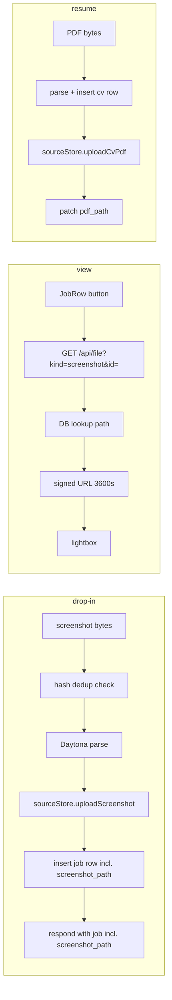

# Blueprint: Source-File Storage v1

Architecture for `source-file-storage-plan.md` (the chosen approach — no
`proposals.md` stage ran; the plan was drafted and reviewed directly). Folds in
the round-1 grill findings (F1–F6). This is the design; the plan holds scope
and sequencing.

## Components

| # | Unit | Single responsibility | Depends on |
|---|------|----------------------|------------|
| 1 | `sources` bucket + 2 columns | Hold the bytes; row carries its file's path | Supabase (manual step 1) |
| 2 | `api/sourceStore.js` | The only code that touches Storage: `uploadScreenshot`, `uploadCvPdf`, `removeByPrefix`, `signedUrl`. Pure wrapper, no route handler export | `@supabase/supabase-js` (service role) |
| 3 | `extract.js` integration | Upload screenshot mid-flow, path onto the job row + response | 2 |
| 4 | `resume.js` integration | Insert cv → upload PDF → patch `pdf_path` | 2 |
| 5 | `api/file.js` | `GET ?kind=screenshot&id=` → signed URL. **v1 kind allowlist = `screenshot` only** (see D1) | 2 |
| 6 | Delete cleanup in `job.js` / `cv.js` | Row delete also removes the stored file, tolerant of null path | 2 |
| 7 | UI: `ViewScreenshot` + lightbox | Button in expanded `JobRow` when `screenshot_path` set → fetch signed URL → overlay | 5 |

Each of 2–6 is testable with the Supabase client mocked; 7 with `vite build` +
headless screenshot (established practice).

## Data flow

## Ordering contracts (the load-bearing part)

**Drop-in (fixes F2, F3-job):** upload happens *after* parse success, *before*
the row insert and *before* `res.json`. The job id (`live-<ts>`) exists before
insert, so the path goes into the **single insert** — no second write, no
path-less row. The response object carries `screenshot_path` (the
`screenshot_hash` strip at the end of `extract.js` must not also strip the
path — this is exactly the 07-08 `created_at` bug class). Upload failure →
job persists and returns without a path (degrade = today's behavior). Insert
failure after a successful upload (e.g. the 23505 dup race) → best-effort
`removeByPrefix` of the just-uploaded file.

**Résumé (F3-cv):** `cv.id` is a serial integer, so insert must come first:
insert → upload to `cvs/<id>.pdf` → patch `pdf_path`. If the patch fails the
file is orphaned *by path column* — which is why delete cleanup never trusts
the column alone.

**Delete cleanup (F3):** on job/cv delete, call `removeByPrefix`
(`screenshots/<job-id>.` / `cvs/<id>.`) **regardless of whether the path
column is null** — deterministic prefixes make orphans reachable. Best-effort:
a storage error never fails the row delete. DoD rewording: "delete removes any
stored file for that row; no file remains reachable after row delete."

## Interfaces

- `sourceStore.uploadScreenshot(bytes, jobId, mediaType) → path | null` —
  media-type allowlist `png|jpeg|webp` → fixed ext; anything else: skip upload,
  return null (F4 — never client-controlled strings in storage keys).
- `sourceStore.uploadCvPdf(bytes, cvId) → path | null` — always `.pdf`.
- `sourceStore.signedUrl(path) → url` — TTL **3600 s exact**: covers a lightbox
  session; a leaked URL dies same-day (F5).
- `GET /api/file?kind=screenshot&id=<job-id>` → `{url}` | 400 bad kind |
  404 unknown id or null path. GET only; path always read from the DB row,
  never from the query string.

## Key decisions

- **D1 (resolves F1): no public CV retrieval in v1.** The app has no login, cv
  ids are small sequential integers — an unauthenticated `kind=cv` route would
  let anyone enumerate and download every stored résumé; the private bucket
  would be privacy theater. v1 has no CV UI anyway (plan: capture-only), so
  `api/file.js` allowlists `screenshot` only. Screenshots are public job
  postings — enumerable, but nothing sensitive. CV retrieval ships with the
  tailored-résumé feature once an access story exists. **Plan-text change:**
  the CV DoD line "retrievable through the signed-URL route" becomes "stored
  and verified via a service-role probe."
- **D2 (resolves F2):** upload is response-critical, not post-response — Vercel
  freezes work scheduled after `res.json`. Latency cost ~one storage PUT,
  accepted.
- **D3 (resolves F6):** step-2 test criterion restated testably: response
  contains no service-role key, no bucket URL, no signed URL — only the bare
  `screenshot_path` string.
- **D4:** one storage wrapper module rather than inline calls in four handlers —
  single mock surface, single place the bucket name and prefixes live.

## Risks

| Risk | Mitigation |
|------|-----------|
| Screenshot signed URLs enumerable via job ids | Accepted: content = public job ads. Revisit if anything sensitive ever lands in `screenshots/` |
| Upload adds latency to the drop-in path | One PUT of bytes already in memory; measure on deployed verify, acceptable within Vercel's 300 s ceiling |
| Preview deploys write to prod storage | Same discipline as DB: throwaway uploads, delete after (plan pitfall retained) |
| `sourceStore.js` lands in `api/` and becomes an accidental route | It exports no default handler, so invocation 404s/errors harmlessly — same situation as `canonicalMap.js` today |
| Orphaned files from partial failures | Deterministic prefixes + delete-time `removeByPrefix` + insert-failure cleanup (ordering contracts above) |

## Domain ownership

Plain web/backend engineering — none of sigma's configured domains
(`ai-agent-engineering`, `llm-engineering`) apply; no LLM call is added or
changed. Standard review axis: code only.

## Next

`/grill --target blueprint`, then fold D1's plan-text change into
`source-file-storage-plan.md` before step 2 begins. Step 1 (manual SQL) is
unchanged by this blueprint.
